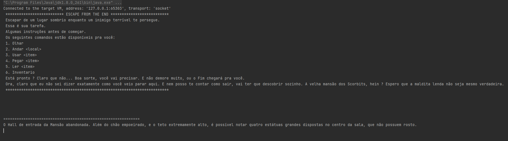
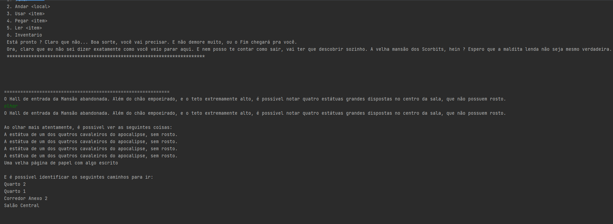
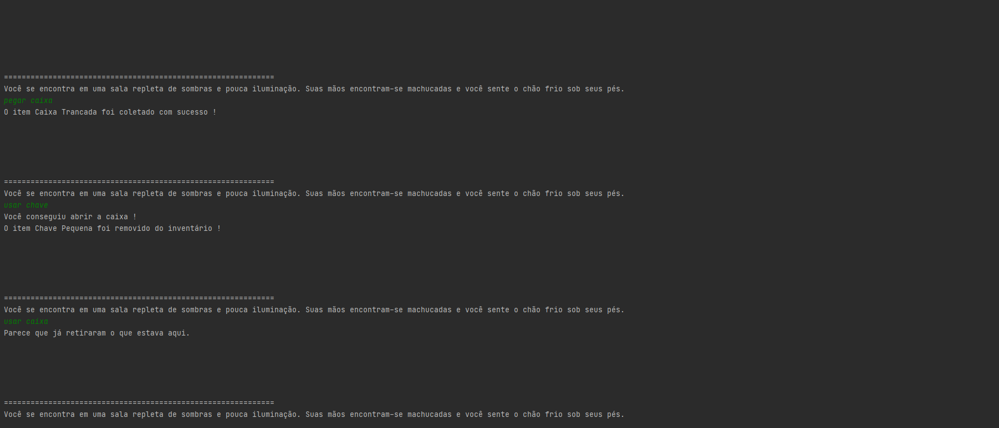

# Text Adventure Game - "Escape from The End"

**Número da Lista**: - 

**Conteúdo da Disciplina**: Trabalho Final 

## Alunos
|Matrícula | Aluno |
| -- | -- |
| 14/0133305  |  Caio Felipe Dias Nunes |
| 15/0016018  |  Lucas Oliveira Silva |

## Sobre 
Utilizando o framework desenvolvido ao longo da disciplina, desenvolvemos um jogo completo no estilo "Escape Room", onde o seu objetivo é resolver os puzzles enquanto foge de um inimigo cruel. Diversos segredos e mistérios permeiam o ar. Será que você é capaz de escapar a tempo ?

Além disso, diversas melhorias foram implementadas em conjunto, como suporte a caminhos bloqueados na estrutura de grafos, correção de diversos bugs encontrados ao longo do desenvolvimento, e também várias implementações possíveis utilizando a estrutura de herança do framework, que podem gerar inúmeras ideias e permitir que você crie seu próprio RPG do zero.

## Screenshots

## Instalação 
**Linguagem**: Java
**Framework**: -  

**Pré-Requisitos**: 
JDK 8.0 ou Superior

## Uso 
O projeto trata-se de uma API de desenvolvimento de jogos em texto, onde apenas utilizando herança de algumas classes chave, é possível implementar um jogo completo, além de adicionar suas próprias particularidades.

Para começar a usar, tente dar uma olhada nas seguintes classes:

1. **ItemDesbloqueavel:** Classe que representa itens que necessitam de outros para serem destravados. Um baú, uma porta trancada, uma caixa de ferramentas lacrada, etc.
2. **ItemConsumível:** Classe que representa um item que possua cargas de uso, e após o término das cargas, será destruído. Uma poção de cura, uma garrafa de água, etc.
3. **ItemChave:** Classe que representa itens que são usados para desbloquear outros itens. Uma chave de uma porta, um alicate para quebrar cadeados, etc.
4. **ItemLegivel:** Classe que representa itens que possuem textos específicios. Livros, diários, cadernos, etc.
5. **ItemDecorativo:** Classe que representa itens que não possuem funções especiais, além de dar maior profundidade ao seu jogo.
6. **ItemChavePorta:** Classe que representa itens necessários para desbloquear caminhos travados no jogo. São vinculados a um caminho e após usados, são destruídos.
7. **ItemIluminador:** Classe que representa itens necessários para iluminar alguma área do jogo. Você pode extender essa classe para criar qualquer item que consiga iluminar um destes locais.
8. **Area:** Classe que representa uma area do seu mapa de jogo. Você pode extender essa classe para criar áreas com propriedades diferentes.
9. **AreaIluminada:** Classe que representa uma area do seu mapa de jogo, onde pode ser especificada uma iluminação. Você pode usá-la para locais visíveis apenas com itens iluminadores.

Para desenvolver seu jogo, você precisa criar Areas e adicioná-las ao mapa através do objeto **JogoController**. Este retorna um singleton do seu jogo, onde estarão armazenados os dados importantes. Você pode adicionar Itens a essas áreas, e conectá-las utilizando os métodos padrão da JogoController. Alguns métodos úteis:

1.**addArea().**   
2.**addItem().**   
3.**conectarArea().**   
4.**listarAreasJogo().**   
5.**imprimeMapaJogo().**   
6.**finalizarJogo()**   

As informações do jogador também podem ser acessadas pelo objeto **JogoController**, então não esqueça de dar uma olhada profunda nesta classe.

Também é interessante se aprofundar na classe **"InterpreteJogador"**. Ela é uma classe responsável por reconhecer comandos de terminal e reproduzir as ações correspondentes, através de chamadas polimórficas a métodos das classes pai (Item, Area, Personagem). As ações possíveis até o momento são:

1.**olhar:** Te dá uma descrição dos itens presentes na sala, e dos caminhos possíveis.  
2.**pegar:** Permite pegar itens que estejam no local.  
3.**andar:** Permite se movimentar através do mapa.   
4.**usar:** Permite interagir com itens que estejam no seu inventário.   
5.**ler:** Permite ler itens que sejam do tipo Legível, como diários, cartas, pergaminhos, etc.  
6.**inventario:** Permite visualizar os itens que o jogador coletou   
7.**comandos:** Permite visualizar todos os comandos disponíveis para o jogador.   

Caso deseje adicionar novas ações aos seus jogadores, apenas adicione um novo elemento ao Enum **"Acao"**, o seu correspondente tipo no enum **"TipoAcao"**, e a respectiva ação a ser executada no método **"agir"** dentro da classe **"InterpreteJogador"**.
